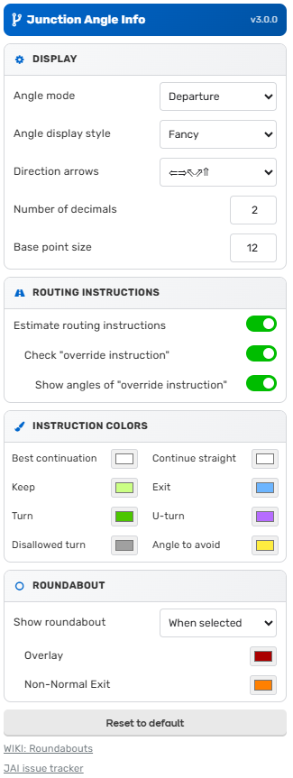

# WME Junction Angle Info

> **Actively maintained.** This repository continues the work of the original
> [milkboy/WME-ja](https://github.com/milkboy/WME-ja) repo, which was archived by its original
> author. All contributor history has been preserved to the best of our ability in keeping with the
> [CC BY-NC-SA 3.0](http://creativecommons.org/licenses/by-nc-sa/3.0/) license.

---

## Description

A [Waze Map Editor (WME)](https://www.waze.com/editor) userscript addon to help with junction design.

- When **two connected segments** are selected, it shows the **turn angle** between them and predicts the routing instruction Waze will give (Keep Left, Turn Right, U-Turn, etc.).
- When **a single segment or node** is selected, it shows the angle between each connected segment.
- Draws angle markers directly on the map canvas for at-a-glance reference while editing.

---

## Installation

1. Install [Tampermonkey](https://www.tampermonkey.net/) for your browser.
2. Click **[Install from GreasyFork](https://greasyfork.org/scripts/35547-wme-junction-angle-info)**.

---

## Features

- Visual angle markers drawn on the WME map layer
- Routing instruction prediction (Keep, Turn, U-Turn, Exit, Roundabout, etc.) with color coding
- Override instruction detection (seb-d59)
- Roundabout circle overlay option
- Configurable angle thresholds (Turn vs Keep, U-Turn, gray zone)
- Per-user settings saved in WME
- Multilingual UI (see [Translations](#translations) below)

---

## Screenshots

---

## Translations

| Language                        | Contributor                                  |
| ------------------------------- | -------------------------------------------- |
| English                         | Michael Wikberg                              |
| Swedish (sv)                    | Michael Wikberg                              |
| Finnish (fi)                    | Michael Wikberg                              |
| Polish (pl)                     | _(contributor unknown — see commit history)_ |
| Russian (ru)                    | Sergey Kuznetsov "WazeRus"                   |
| Czech (cs)                      | MajkiiTelini                                 |
| Latin-American Spanish (es-419) | witoco                                       |
| French (fr)                     | seb-d59                                      |
| Ukrainian (uk)                  | Sapozhnik                                    |
| British English (en-GB)         | ccclxv                                       |

---

## Contributors

This script is a community effort spanning more than a decade. The following contributors are
credited based on codebase history, commit logs, and community records:

| Contributor      | Handle        | Year(s)   | Contribution                                                              |
| ---------------- | ------------- | --------- | ------------------------------------------------------------------------- |
| Michael Wikberg  | milkboy       | 2013–2019 | Original author; core logic, architecture, Swedish & Finnish translations |
| Paweł Pyrczak    | tkr85         | 2014      | WME update compatibility fixes                                            |
| —                | AlanOfTheBerg | 2014      | WME update compatibility fixes                                            |
| —                | berestovskyy  | 2014      | WME update compatibility fixes                                            |
| —                | FZ69617       | 2015      | Best-continuation (BC) logic fixes                                        |
| —                | wlodek76      | 2015      | Contributions                                                             |
| Sergey Kuznetsov | WazeRus       | 2016      | Russian translation                                                       |
| —                | MajkiiTelini  | 2016      | Czech translation                                                         |
| —                | witoco        | 2016      | Latin-American Spanish translation                                        |
| —                | seb-d59       | 2017–2018 | French translation; override instruction detection                        |
| —                | Sapozhnik     | 2019      | Ukrainian translation                                                     |
| —                | ccclxv        | —         | British English (UK) translation                                          |
| —                | g1220k        | —         | Contributions                                                             |
| —                | JS55CT        | 2025+     | Current maintainer; SDK migration                                         |

> If you contributed and are not listed, or if any information above is incorrect, please open an
> issue or pull request.

---

## License

**WME Junction Angle Info** is licensed under a
[Creative Commons Attribution-NonCommercial-ShareAlike 3.0 Unported License](http://creativecommons.org/licenses/by-nc-sa/3.0/deed.en_US).

**Original work** copyright © 2013–2019 Michael Wikberg \<waze@wikberg.fi\>

**Adapted and continued** by JS55CT, WazeDev, and contributors, 2025–present.

This is an adapted work derived from [milkboy/WME-ja](https://github.com/milkboy/WME-ja). Changes
include updated WazeWrap SDK integration and ongoing maintenance. Under CC BY-NC-SA:

- **Attribution (BY):** You must credit all contributors listed above and link to the original source.
- **NonCommercial (NC):** You may not use this work for commercial purposes.
- **ShareAlike (SA):** If you adapt or redistribute this work, you must use the same CC BY-NC-SA 3.0 license.

Source code and issue tracker: [https://github.com/JS55CT/WME-ja](https://github.com/JS55CT/WME-ja)

---

## Changelog

### 3.0.0 _(current — in development)_

- SDK migration to current WME / WazeWrap APIs (in progress)

### 2.2.16 _(Feb 6, 2025)_

- Last release of the 2.x series

### 2.x series _(GreasyFork continuation)_

- Migrated from browser extension model to Tampermonkey userscript via WazeWrap
- Requires [WazeWrap](https://greasyfork.org/scripts/24851-wazewrap) helper library
- Ongoing maintenance following original author archiving the repository

---

### 1.x series _(original milkboy/WME-ja — archived)_

See the [original repository](https://github.com/milkboy/WME-ja) for the full 1.x changelog.

#### 1.13.1

- Update for new WME URLs

#### 1.13.0

- Update for new WME
- Added Czech translation (thanks to MajkiiTelini)

#### 1.12.0

- Don't run on user pages
- Add option for showing/hiding the JAI layer on page load

#### 1.11.0

- Bootstrap fixes; U-turn feature polishing

#### 1.10.0

- Several updates for changed Waze routing logic (better name matching, angle changes)
- U-turn support; script loading and style tweaks

#### 1.9.0

- Improved roundabout routing logic
- Fixed several BC routing instruction guessing issues
- Added Polish translation
- Added new presentation style and arrow options for routing instructions

#### 1.8.x

- Date range restriction detection fixes
- BC logic segment filtering fix
- Settings tab tweaks; added missing translations for angle mode selection
- Added support for JAI showing departure angles with routing instructions as default

#### 1.8.1

- BC logic fixes by FZ69617

#### 1.7.0

- Roundabout checking with color-coded display
- Added option for roundabout circle display (always / when selected / never)

#### 1.6.x

- Color codes for different turn instructions; user-configurable options
- Input validation and WME look & feel
- Permalink fixes for selected nodes; settings load fix for Chrome extension

#### 1.5.x

- Translation support added (Swedish first)
- WME update compatibility fixes by tkr85, AlanOfTheBerg, berestovskyy
- Various URL and layer display fixes

#### 1.2

- "0" angle empty label fix
- Hide markers on zoom levels where segments are not visible
- Marker distance now zoom-dependent
- Fix for segment-deletion crash

#### 1.0 – 1.1

- Show "turn angle" in green for connected segments
- Show all junction angles on map canvas
- Firefox (Greasemonkey) support
